<font face="宋体">

&nbsp;
**<font size=12><p align="center">计算机图形学项目报告</p></font>**
&nbsp;
<font size=6><p align="center">Project1 【曲线和曲面造型技术】 </p></font>
&nbsp;&nbsp;
&nbsp;&nbsp;

<div align=center></div>

&nbsp;&nbsp;&nbsp;&nbsp;
<font size=5>

&nbsp;
<center>
学生姓名：<u>叶兴松</u> 
    &nbsp&nbsp
学生姓名：<u>秦铮</u> 
</center>

&nbsp;
<center>
学&ensp;号：<u>20307130227</u> &ensp;
学&ensp;号：<u>20307130169</u> &ensp;
</center>

&nbsp;
<center>
专&ensp;业：<u>计算机科学与技术</u> &ensp;
专&ensp;业：<u>计算机科学与技术</u> &ensp;
</center>

&nbsp;
<center>
日&ensp;&ensp;期：<u>2023/04/xx</u>
</center>

</font>

<div STYLE="page-break-after: always;"></div>

## 一、曲线的绘制：

### evalCircle()函数理解：

对于具体实现贝塞尔曲线和B样条曲线的绘制，我们先要对样例（即圆形曲线的绘制）有充分的认识，包括具体结构的设计、公式的运算、返回的结果。

这里先开了一个大小为steps+1的R，R为Curve类型。

```c++
Curve R(steps + 1);
```

Curve类型定义为含多个CurvePoint的vector，可理解为多个点的集合，这些点内部的参数有V（位置）、T（切线）、B（次法线）、N（法线），且后三者表示的是方向，故定义为单位向量。

```c++
struct CurvePoint
{
    Vector3f V; // Vertex
    Vector3f T; // Tangent  (unit)
    Vector3f N; // Normal   (unit)
    Vector3f B; // Binormal (unit)
};

// This is just a handy shortcut.
typedef std::vector< CurvePoint > Curve;
```

要填充R，即求得每个R[i]的V、T、B、N。

此处的圆定义在xy平面上，设夹角为t，通过极坐标的定义可以得出圆上steps+1个点的位置。

$$V_i=(x,y,z)=(r*cos(t),sin(t),0)$$     (r为半径)

再利用公式：

$$T_i=V_i^`.normalized()$$

$$N_i=B_{i-1}\times T_i .normalized()$$

$$B_i=T_i\times N_i .normalized()$$

此处$$B_i$$初始化为(0,0,1)，可保证$$B_i$$一直为该值。

额外需要注意的是，圆为闭合曲线，需要对首尾做重合处理。这里i=0和i=steps的t分别为0和2$$\pi$$，恰好保证三角函数相等，做到了重合，这也是初始定义steps+1的原因。


### evalBezier()函数实现：

先理解四项三次贝塞尔曲线的生成：

每条曲线由一组（四项）点为基进行构成，通过关于t$$(\in [0,1])$$和四个点坐标的公式得到P(t)，t从小到大连接P(t)即得到所需的曲线。

公式[详见教材P215]以矩阵形式表示为：

$$\begin{pmatrix}
P_1 & P_2 & P_3 & P_4
\end{pmatrix}
\begin{pmatrix}
1-3t+3t^2-t^3=(1-t)^3 \\
3t-6t^2+3t^3=3(1-t)^2 \\
3t^2-3t^3=3t^2(1-t) \\
t^3
\end{pmatrix}$$

再看输入：

```c++
(const vector<Vector3f> &P, unsigned steps)
```

`<Vector3f>`可理解为一个点，P即为一系列控制点的集合，steps即为一组点内所需再生成的个数（即t的个数）。

此外，我们需要厘清需要多少个控制点，其会产生多少组。

第一组点即前4个点，这也是控制点的最少数。从第二组点开始，为保证曲线的连贯性，控制点的开始要与上一组的结束一样，如第二组的4个点是第4、5、6、7个点。以此类推，故需要3k+1个点，形成k组，每组会生成steps个点。

由此，可给出Bez的声明：

```c++
int control_group = P.size() / 3;
Curve Bez(control_group * steps);
```

同样地，运用V、T、B、N的逐步计算公式。

V在上面已给出，T对V关于t求导再单位化即可，B、N按照递推公式代入，同时注意单位化。

需要特别注意的是，第一个N（i=0，j=0）由于前面的B还未求出，需要额外拿出来，将其前面的B视为(0,0,1)再与T叉积单位化。

综上，可给出具体的实现：

```c++
for (int i = 0; i < control_group; i++)
	{

		for (int j = 0; j < steps; j++)
		{
			float t = float(j) / steps;
			Bez[steps * i + j].V = (1 - t) * (1 - t) * (1 - t) * P[3 * i] + 3 * t * (1 - t) * (1 - t) * P[3 * i + 1] + 3 * t * t * (1 - t) * P[3 * i + 2] + t * t * t * P[3 * i + 3];

			Bez[steps * i + j].T = (-3 * (1 - t) * (1 - t) * P[3 * i] + 3 * (1 - 3 * t) * (1 - t) * P[3 * i + 1] + 3 * t * (2 - 3 * t) * P[3 * i + 2] + 3 * t * t * P[3 * i + 3]).normalized();

			if (i + j == 0)
				Bez[steps * i + j].N = Vector3f::cross(Vector3f(0, 0, 1), Bez[steps * i + j].T).normalized();
			else
				Bez[steps * i + j].N = Vector3f::cross(Bez[steps * i + j - 1].B, Bez[steps * i + j].T).normalized();

			Bez[steps * i + j].B = Vector3f::cross(Bez[steps * i + j].T, Bez[steps * i + j].N).normalized();
		}
	}
```


### evalBspline()函数实现：

相较于四项三次贝塞尔曲线，四项三次B样条曲线有相似之处，也有不同之处。

不同在于，B样条曲线会更加连贯，这是因为B样条曲线的控制点组的划分导致的。第一组与贝塞尔曲线一样，都是前四个点，但第二组的取法，B样条曲线会以第二个点作为开始。我们可以用窗口大小为4的滑动窗口来进行理解：贝塞尔曲线的窗口每次后移3个窗口，而B样条曲线的窗口每次只后移3个窗口。

由此可得，B样条曲线的组数为P.size() - 3，每组依然是steps个控制点。

相似地，可给出B样条曲线的公式（以矩阵形式表示）为：

$$\begin{pmatrix}
P_1 & P_2 & P_3 & P_4
\end{pmatrix}
\begin{pmatrix}
\frac{1-3t+3t^2-t^3}{6}=\frac{(1-t)^3}{6} \\
\frac{4-6t^2+3t^3}{6} \\
\frac{1+3t+3t^2-3t^3}{6} \\
\frac{t^3}{6}
\end{pmatrix}$$

类似于贝塞尔曲线，修改V和T的计算复用其代码即可，不做赘述。

在曲面的绘制中，我们发现了B样条曲线存在闭合的问题需要考虑。经过对样例的查看，我们发现，其对闭合的定义是最后三个点与最初三个点重合。在这一条件下，我们通过将最初的`CurvePoint`加入到`Curve`集合中以保证闭合。

```c++
if (P[control_group] == P[0] && P[control_group + 1] == P[1] && P[control_group + 2] == P[2])
		Bsp.push_back(Bsp[0]);
```


#### 曲线生成效果展示：

core:

<div align=center>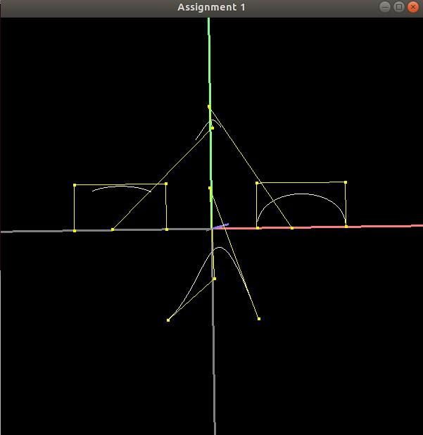</div>

#### B样条曲线闭合生成效果展示：

bsp（见[bsp.swp](./swp/bsp.swp)）:

<div align=center>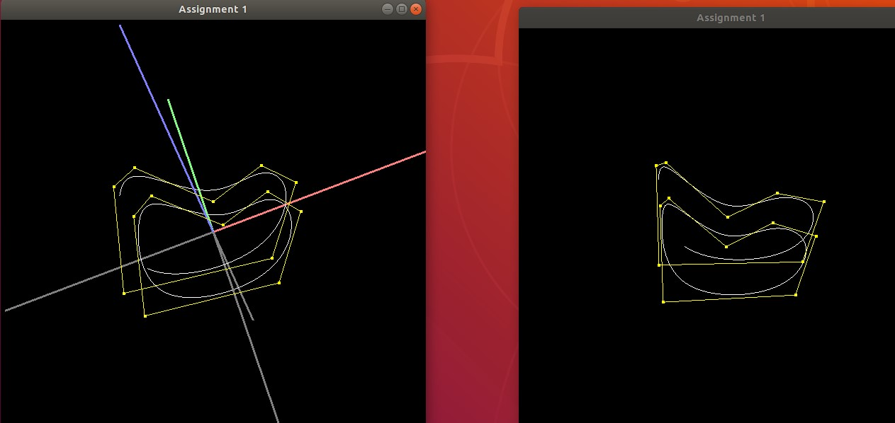</div>

$$
左图为代码生成，右图为样例生成，上曲线未闭合，下曲线闭合
$$


## 二、曲面的绘制：

### makeSurfRev()函数实现：
该函数需要实现旋转表面的生成，具体功能是根据所给出的在xy平面中的曲线，生成该曲线绕y轴旋转一周得到的曲面。  

相似地，先看Surface类型的定义：

```c++
struct Surface
{
    std::vector< Vector3f > VV;
    std::vector< Vector3f > VN;
    std::vector< Tup3u > VF;
};
```

Surface由许多点组成（VV），每个点有对应的法向量（VN，方向向外），每相邻4个点构成两个三角形（VF）。

再看输入：

```c++
(const Curve &profile, unsigned steps)
```

首先，根据profile中的xy平面上的控制点，我们通过均匀采样steps次的旋转方式复制这些控制点，从而生成整个曲面上的控制点。

绕y轴的旋转矩阵可表示为

$$Rot_y(\theta) =
\begin{pmatrix}
\cos\theta & 0 & \sin\theta \\
0 & 1 & 0 \\
-\sin\theta & 0 & \cos\theta
\end{pmatrix}$$

则$$VV=Rot_y(\theta)\times V$$

在复制控制点的同时，还要复制生成法向量，法向量的变换矩阵应当是控制点变换矩阵的逆的转置。旋转矩阵是正交阵，自然满足逆的转置是它本身。同时，需要注意的是，法向量的方向决定了最终图像中的抛光面，这里需要取负值使得最终生成曲面的抛光面在外侧。

即$$VN=-Rot_y(\theta)\times N$$

``` c++
    int n = profile.size();
    for (int i = 0; i < steps; i++)
    {
        float t = 2.0f * c_pi * float(i) / steps;
        float ct = cos(t);
        float st = sin(t);

        for (int j = 0; j < n; j++)
        {
            surface.VV.push_back(Vector3f(ct * profile[j].V[0] + st * profile[j].V[2], profile[j].V[1], -st * profile[j].V[0] + ct * profile[j].V[2]));
            surface.VN.push_back(Vector3f(-ct * profile[j].N[0] - st * profile[j].N[2], -profile[j].N[1], st * profile[j].N[0] - ct * profile[j].N[2]));
        }
    }
```
在上述均匀添加控制点之后，需要再复制一遍前n个控制点和法向量，这是为了保证最后绘制出来的曲面是闭合的。
``` c++
    for (int j = 0; j < n; j++)
        {
            surface.VV.push_back(surface.VV[j]);
            surface.VN.push_back(surface.VN[j]);
        }
```
最后，需要根据这些控制点依次生成三角形面。

在具体实现的过程中，我们定义了addTriangle()函数，方便后续函数复用。在该函数中，按照顺序遍历除最后一组重复的控制点，获得三角形顶点的编号组。至此，获得生成平面所需要的控制点，法向量和三角面。

``` c++
void addTriangle(Surface &surface, const int &n)
{
    int k = 0;
    int m = surface.VV.size();
    while (k < m - n)
    {
        if ((k + 1) % n != 0)
        {
            surface.VF.push_back(Tup3u(k, k + 1, k + n));
            surface.VF.push_back(Tup3u(k + n, k + 1, k + n + 1));
        }
        k++;
    }
}
```
#### 旋转曲面生成效果展示：

norm:  
<div align=center>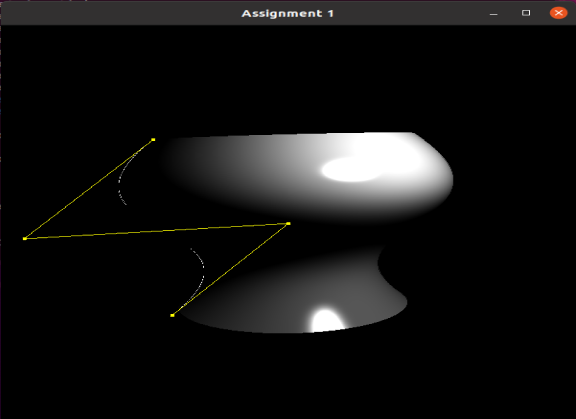</div>

wineglass:  
<div align=center>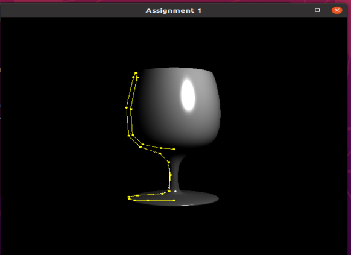</div>


### makeGenCyl()函数实现：

该函数需要实现广义圆柱体的生成。和旋转平面生成不同的是，广义圆柱体的生成是由profile中定义的曲线围绕sweep定义的曲线扫掠而成。和旋转平面生成的逻辑一样，需要生成控制点、法向量和三角面。

控制点的生成需要遍历扫掠曲线中的控制点，根据这些控制点的NBTV向量进行矩阵变换生成广义圆柱体的控制点。

NBT矩阵相当于之前的旋转矩阵$$Rot_y(\theta)$$，NBTV矩阵则是完成坐标系旋转和平移的变换矩阵。

$$Rot =
\begin{pmatrix}
N \\
B \\
T
\end{pmatrix}$$

$$T =
\begin{pmatrix}
Rot \  |0 \\
V \ \ \ | 1\\
\end{pmatrix}$$

$$VV=T\times (V\ |\ 1)[:3]$$

法向量的生成和控制点类似，旋转矩阵依然满足转置和逆的一致性，但是需要取负控制抛光面在外侧。

``` c++
    for (int i = 0; i < sweep.size();; i++)
        {

            Matrix4f nbtv_mat(Vector4f(sweep[i].N, 0), Vector4f(sweep[i].B, 0), Vector4f(sweep[i].T, 0), Vector4f(sweep[i].V, 1));
            Matrix3f nbt_mat = nbtv_mat.getSubmatrix3x3(0, 0);

            for (int j = 0; j < profile.size();; j++)
            {

                surface.VV.push_back((nbtv_mat * Vector4f(profile[j].V, 1)).xyz());
                surface.VN.push_back(-1 * nbt_mat * profile[j].N);
            }
        }
```
最后是三角面的生成，这里直接复用上述的addTriangle()函数即可。

#### 广义圆柱体生成效果展示：

tor:
<div align=center>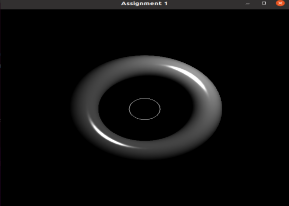</div>

flircle:
<div align=center>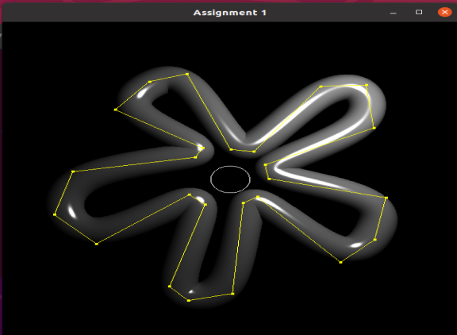</div>

florus:
<div align=center>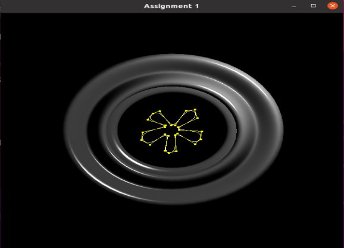</div>

gentorus:
<div align=center>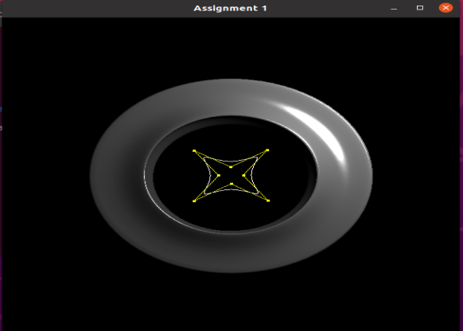</div>

weird:
<div align=center>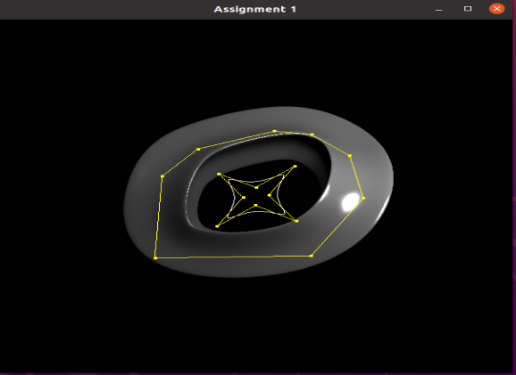</div>


## 三、解决闭合问题：
### 曲面闭合问题解决：
广义曲面生成时，存在曲面错位不闭合的问题。该问题产生的原因是扫掠线末端与首端的控制点法线和次法线存在较大差异，直接将曲线通过控制点连起来会出现“断层感”。可考虑使用插值的方法重构末尾的控制点来解决该问题：  
首先，我们对“断层感”做了量化，即末端控制点与首端控制点法线的差值。通过差值是否达到阈值0.1判定是否要进行插值运算，同时也计算出法线差值的大小由于确定重构末尾的控制点的个数flag。然后，再比较首末扫掠线中的控制点来判断该曲线本身是否闭合，如果其本身就不闭合，就没有必要进行后续闭合生成曲面的处理，这里将重构个数flag置0即可。

``` c++
    int flag = int((sweep[m - 2].N - sweep[0].N).abs() * 10);
    if (sweep[0].V != sweep[m - 1].V)
        flag = 0;
```
接下来，我们对闭合且满足“断层感”的曲面进行插值操作。先对控制点进行类似于GBN（回退N帧）的操作，将遍历个数降低为m - flag个。

```c++
for (int i = 0; i < m - flag; i++)
```

然后再在这之间通过回退后的最后一个点和首端点进行线性插值：

$$P_t=(1 - f)*P_1+f*P_0(f\in [0,1])$$

注意除了位置V之外，其余都需要进行单位化。

``` c++
    if (flag > 0)
    {
        for (float f = 0; f <= 1; f += 1.0 / float(flag))
        {
            Vector3f SN = ((1 - f) * sweep[m - flag - 1].N + f * sweep[0].N).normalized();
            Vector3f SB = ((1 - f) * sweep[m - flag - 1].B + f * sweep[0].B).normalized();
            Vector3f ST = ((1 - f) * sweep[m - flag - 1].T + f * sweep[0].T).normalized();
            Vector3f SV = ((1 - f) * sweep[m - flag - 1].V + f * sweep[0].V);
            Matrix4f _nbtv_mat(Vector4f(SN, 0), Vector4f(SB, 0), Vector4f(ST, 0), Vector4f(SV, 1));
            Matrix3f _nbt_mat = _nbtv_mat.getSubmatrix3x3(0, 0);

            for (int j = 0; j < n; j++)
            {

                surface.VV.push_back((_nbtv_mat * Vector4f(profile[j].V, 1)).xyz());
                surface.VN.push_back(-1 * _nbt_mat * profile[j].N);
            }
        }
    }
```
### 曲面闭合问题效果展示：
weirder:
<div align=center>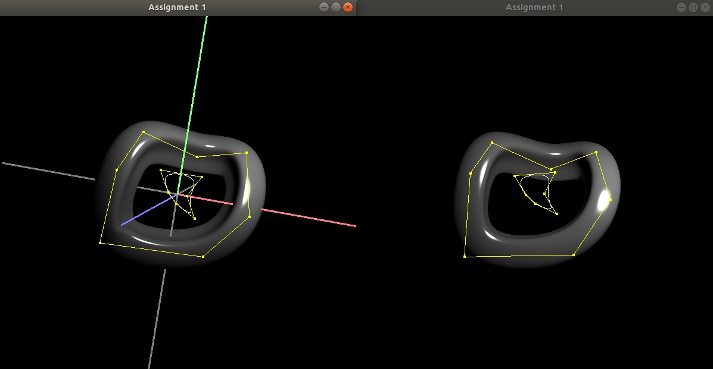</div>

$$
左图为代码生成，右图为样例生成，但由于我们做的是线性插值，在左下角会毛刺产生，和样例仍有些许差距
$$

这里我们添加了扫掠线本身不闭合的测试样例，测试数据（[unclosed.swp](./swp/unclosed.swp)）和测试效果如下 
unclosed:

<div align=center>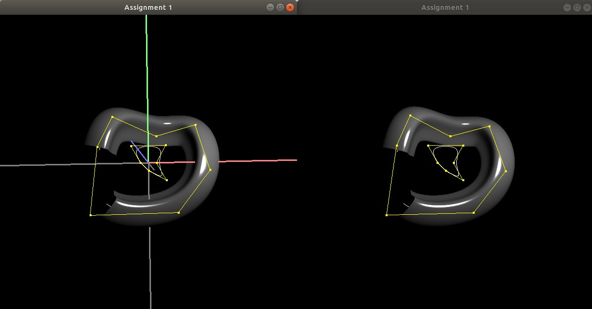</div>

$$
左图为代码生成，右图为样例生成
$$

最后，得益于我们设计的闭合曲线判断机制和GBN机制，其他曲线会照原样显示，之前展示的截图均为最后代码运行的结果。


## 参考

[三次B样条曲线拟合算法](https://blog.csdn.net/liumangmao1314/article/details/54588155)

[证明：旋转矩阵是正交矩阵](https://blog.csdn.net/qq_41951923/article/details/103540506)


</font>

