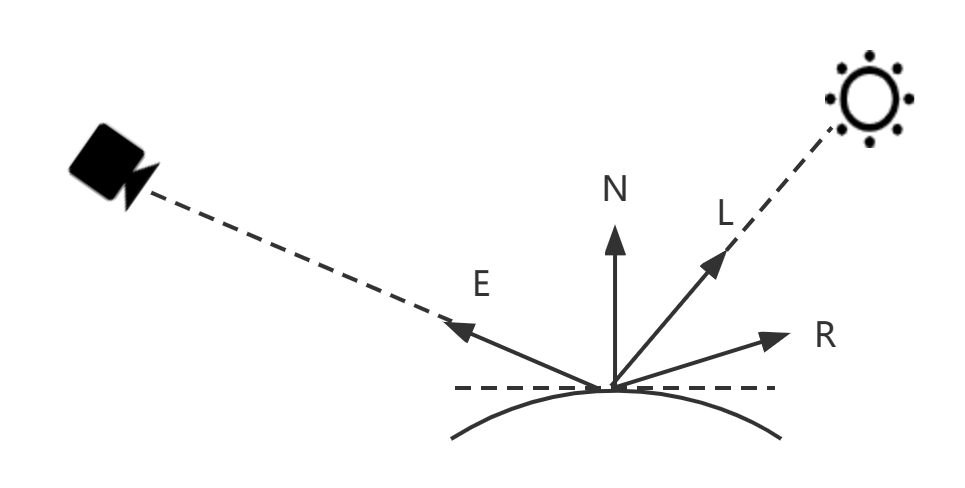
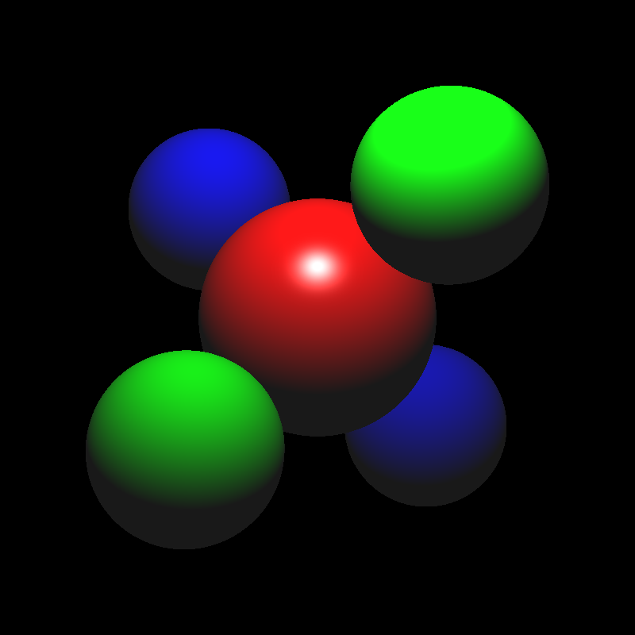
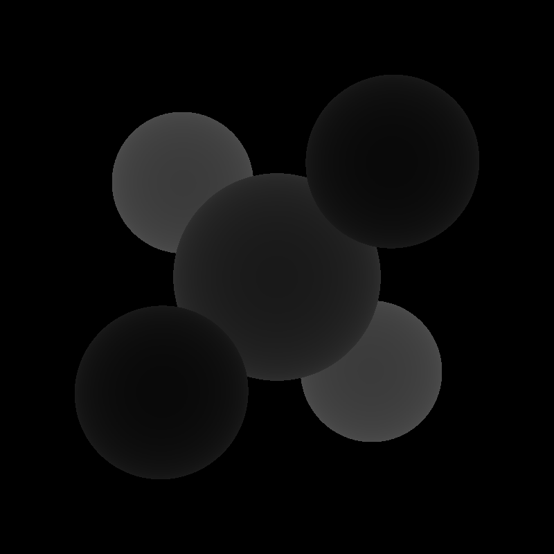
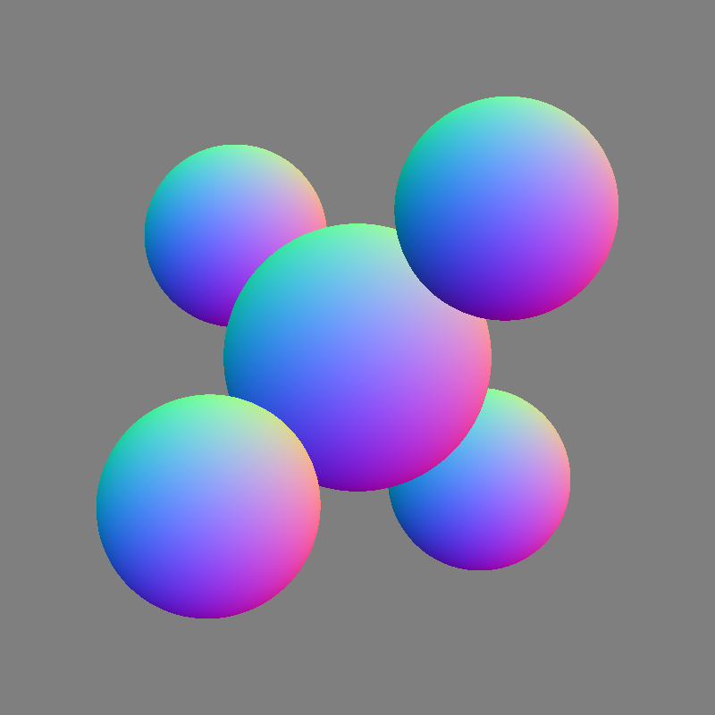

<font face="宋体">

&nbsp;
**<font size=12><p align="center">计算机图形学项目报告</p></font>**
&nbsp;
<font size=6><p align="center">Project2 【光照模型与光线追踪】 </p></font>
&nbsp;&nbsp;
&nbsp;&nbsp;

<div align=center></div>

&nbsp;&nbsp;&nbsp;&nbsp;
<font size=5>

&nbsp;
<center>
学生姓名：<u>叶兴松</u> 
    &nbsp&nbsp
学生姓名：<u>秦铮</u> 
</center>

&nbsp;
<center>
学&ensp;号：<u>20307130227</u> &ensp;
学&ensp;号：<u>20307130169</u> &ensp;
</center>

&nbsp;
<center>
专&ensp;业：<u>计算机科学与技术</u> &ensp;
专&ensp;业：<u>计算机科学与技术</u> &ensp;
</center>

&nbsp;
<center>
日&ensp;&ensp;期：<u>2023/05/xx</u>
</center>


</font>

<div STYLE="page-break-after: always;"></div>

## 一、Phong光照模型：

#### 实现PointLight::getIllumination()

参照`DirectionalLight::getIllumination`的实现，可知需要为三个值赋值，即tolight、intensity、distToLight，这三个值的具体含义分别是：

- tolight：从场景中一个点（着色点）指向到光源的单位方向矢量
- intensity：照明强度（RGB）
- distToLight：着色点与光源之间的距离

在`PointLight::getIllumination`的实现中，`_position`为点光源，`p`为着色点，`_color`是光源的颜色，`_falloff`是光强衰减因子。

`tolight`则是由`p`指向`_position`的单位方向矢量。

```c++
tolight = (_position - p).normalized();
```

`distToLight`则是`p`到`_position`的距离。

```c++
distToLight = (_position - p).abs();
```

`intensity`用公式表示为：$L=\frac{I}{\alpha d^2}$（$I$为`_color`，$\alpha$为`_falloff`，$d$为`distToLight`）。

```C++
intensity = _color / (distToLight * distToLight * _falloff);
```


#### 实现Material::shade()

即是分别实现漫反射（diffuse）和镜面反射（specular）着色器，再将二者求和。

Phong光照模型的示意图如下：

<div align=left></div>

各个方向表示的含义：

- N是hit处切表面的法线方向
- E是指向相机的方向
- L是指向光源的方向
- R是E关于N的对称方向，也叫完美反射矢量

计算漫反射阴影的公式表达为：

$ clamp(L,N)=Max(0\ ,\  L\cdot N)$

结合漫反射材料的反射率$k_{diffuse}$和光强Li​，漫反射的光照强度为：

$I_{diffuse} = clamp(L,N)*Li*k_{diffuse})$

在代码中，`dirToLight`对应着L，N则由`hit.getNormal()`获得，Li是`lightIntensity`，$k_{diffuse}$是`_diffuseColor`。

漫反射的代码计算如下：

```C++
float clamp_LN = max(0 , Vector3f::dot(dirToLight, hit.getNormal()));
Vector3f diffuse = clamp_LN * lightIntensity * _diffuseColor;
```


接着实现镜面反射着色器，如Phong光照模型的示意图所示

结合镜面反射材料的反射率$k_{specular}$和光强Li以及光泽度s，漫反射的光照强度为镜面反射项的公式可表示为：

$I_{specular} = clamp(L,R)^s*Li*k_{specular})$

在代码中，`ray.getDirection()`对应着E的反方向，即-E，$k_{specular}$是`_specularColor`，s是`_shininess`。

镜面反射的代码计算如下：


最后，`shade`函数返回$I_{diffuse}+I_{specular}$即可。


#### 完成Phong光照模型的计算

Phong光照模型的计算由环境光与各个光源的漫反射和镜面反射（即`shade`返回值）求和可得，公式表示为：

$I=I_{ambient}+\sum I_{shade}$

在代码中，原始`traceRay`函数先判断相交，若相交则直接返回了材质的漫反射颜色。

为实现上述公式，$I_{ambient}$由`_scene.getAmbientLight()`得到；同时遍历`_scene.lights`并通过`shade`获取各个各个光源的漫反射和镜面反射之和，所需的参数值由`getIllumination`计算得到。

具体的代码实现：

```c++
Vector3f color(0, 0, 0);
for (int i = 0; i < _scene.lights.size(); i++)
        {
            Vector3f dirToLight;
            Vector3f lightIntensity;
            float distToLight;
            _scene.lights[i]->getIllumination(r.pointAtParameter(h.getT()), dirToLight, lightIntensity, distToLight);
            color += h.getMaterial()->shade(r, h, dirToLight, lightIntensity);
        }
color += _scene.getAmbientLight();
return color;
```


#### 效果展示

<div style="display:flex;">
  
  
  
</div>


## 二、光线投射：


## 三、光线追踪与阴影投射：


## 四、抗锯齿的问题


## 参考


</font>

