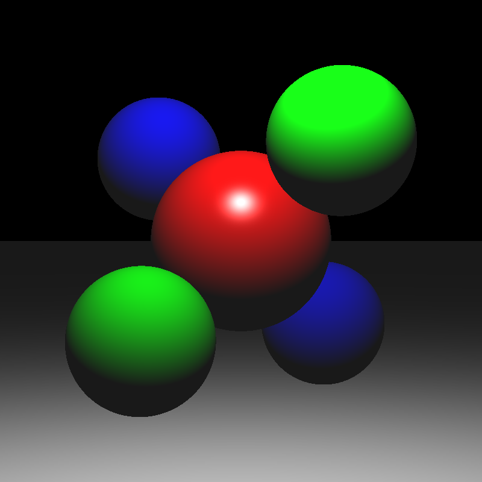
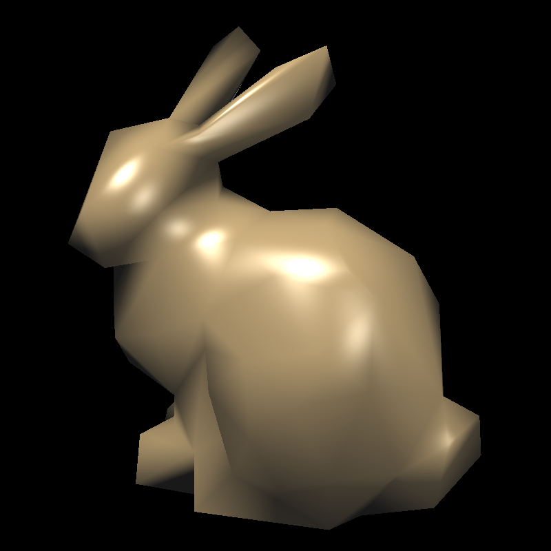
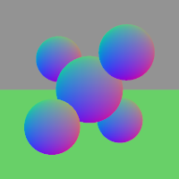

<font face="宋体">

&nbsp;
**<font size=12><p align="center">计算机图形学项目报告</p></font>**
&nbsp;
<font size=6><p align="center">Project2 【光照模型与光线追踪】 </p></font>
&nbsp;&nbsp;
&nbsp;&nbsp;

<div align=center></div>

&nbsp;&nbsp;&nbsp;&nbsp;
<font size=5>

&nbsp;
<center>
学生姓名：<u>叶兴松</u> 
    &nbsp&nbsp
学生姓名：<u>秦铮</u> 
</center>

&nbsp;
<center>
学&ensp;号：<u>20307130227</u> &ensp;
学&ensp;号：<u>20307130169</u> &ensp;
</center>

&nbsp;
<center>
专&ensp;业：<u>计算机科学与技术</u> &ensp;
专&ensp;业：<u>计算机科学与技术</u> &ensp;
</center>

&nbsp;
<center>
日&ensp;&ensp;期：<u>2023/05/xx</u>
</center>


</font>

## 一、Phong光照模型：

#### 实现PointLight::getIllumination()

参照`DirectionalLight::getIllumination`的实现，可知需要为三个值赋值，即tolight、intensity、distToLight，这三个值的具体含义分别是：

- tolight：从场景中一个点（着色点）指向到光源的单位方向矢量
- intensity：照明强度（RGB）
- distToLight：着色点与光源之间的距离

在`PointLight::getIllumination`的实现中，`_position`为点光源，`p`为着色点，`_color`是光源的颜色，`_falloff`是光强衰减因子。

`tolight`则是由`p`指向`_position`的单位方向矢量。

```c++
tolight = (_position - p).normalized();
```

`distToLight`则是`p`到`_position`的距离。

```c++
distToLight = (_position - p).abs();
```

`intensity`用公式表示为：$L=\frac{I}{\alpha d^2}$（$I$为`_color`，$\alpha$为`_falloff`，$d$为`distToLight`）。

```C++
intensity = _color / (distToLight * distToLight * _falloff);
```


#### 实现Material::shade()

即是分别实现漫反射（diffuse）和镜面反射（specular）着色器，再将二者求和。

Phong光照模型的示意图如下：

<div align=left></div>

各个方向表示的含义：

- N是hit处切表面的法线方向
- E是指向相机的方向
- L是指向光源的方向
- R是E关于N的对称方向，也叫完美反射矢量

计算漫反射阴影的公式表达为：

$ clamp(L,N)=Max(0\ ,\  L\cdot N)$

结合漫反射材料的反射率$k_{diffuse}$和光强Li​，漫反射的光照强度为：

$I_{diffuse} = clamp(L,N)*Li*k_{diffuse})$

在代码中，`dirToLight`对应着L，N则由`hit.getNormal()`获得，Li是`lightIntensity`，$k_{diffuse}$是`_diffuseColor`。

漫反射的代码计算如下：

```C++
float clamp_LN = std::max(0.0f , Vector3f::dot(dirToLight, hit.getNormal()));
Vector3f diffuse = clamp_LN * lightIntensity * _diffuseColor;
```


接着实现镜面反射着色器，如Phong光照模型的示意图所示

结合镜面反射材料的反射率$k_{specular}$和光强Li以及光泽度s，漫反射的光照强度为镜面反射项的公式可表示为：

$I_{specular} = clamp(L,R)^s*Li*k_{specular})$

在代码中，`ray.getDirection()`对应着E的反方向，即-E，$k_{specular}$是`_specularColor`，s是`_shininess`。

R未直接给出，需要计算得到

如上示意图，E和R关于N对称，且均为单位矢量。则E和R的和矢量与N重合，长度为E和R分别在N上的投影之和（2倍E在N上投影）。故可得R的公式：$ R=(2*E\cdot N)*N-E$

镜面反射的代码计算如下：

```c++
float clamp_LR = std::max(0.0f, Vector3f::dot(dirToLight, 2.0 * Vector3f::dot(-ray.getDirection(), hit.getNormal()) * hit.getNormal() + ray.getDirection()));
Vector3f specular = pow(clamp_LR, _shininess) * lightIntensity * _specularColor;
```

最后，`shade`函数返回$I_{diffuse}+I_{specular}$即可。


#### 完成Phong光照模型的计算

Phong光照模型的计算由环境光与各个光源的漫反射和镜面反射（即`shade`返回值）求和可得，公式表示为：

$I=I_{ambient}+\sum I_{shade}$

在代码中，原始`traceRay`函数先判断相交，若相交则直接返回了材质的漫反射颜色。

为实现上述公式，$I_{ambient}$由`_scene.getAmbientLight()`得到；同时遍历`_scene.lights`并通过`shade`获取各个各个光源的漫反射和镜面反射之和，所需的参数值由`getIllumination`计算得到。

具体的代码实现：

```c++
Vector3f color(0, 0, 0);
for (int i = 0; i < _scene.lights.size(); i++)
        {
            Vector3f dirToLight;
            Vector3f lightIntensity;
            float distToLight;
            _scene.lights[i]->getIllumination(r.pointAtParameter(h.getT()), dirToLight, lightIntensity, distToLight);
            color += h.getMaterial()->shade(r, h, dirToLight, lightIntensity);
        }
color += _scene.getAmbientLight();
return color;
```


#### 效果展示

<div style="display:flex;">
  
  
  
</div>


## 二、光线投射：

#### 理解Sphere::intersect()

这个抽象为数学问题就是，已知球的球心和半径、投射点的位置和方向，求该点与球是否有交点，若有则求沿光线
相交范围内的最近交点。

以球心为原点O（0，0，0），设投射点为P（x，y，z）、投射方向为R（i，j，k）。

则交点的参数化表达可为P+tR=（x+it，y+jt，z+kt），且在球上，其坐标满足方程：$x^2+y^2+z^2=r^2$

联立可得关于t一元二次方程$ax^2+bx+c=0$。

其中，$a=R^2,\ b=2*R\cdot P,\  c=P^2-r^2$

再利用求根公式得出无解或具体解，取满足相交范围（>tmin）的最小t值作为解。

最后返回hit的所需参数分别是t，材质和球心指向交点的方向单位量。


#### 实现Plane::intersect()

首先，需要补充`Plane`的`private`成员。根据`Plane(const Vector3f &normal, float d, Material *m);`构造函数以及`Plane : Object3D(m)`，可知需补充的成员是：

```c++
Vector3f _normal; 
float _d;
```

其中，`_normal`是平面的单位法向量，`_d`是原点到平面的距离。

同样，我们用参数表达来对交点进行表示：P+tR（投射点为P，投射方向为R）。

再有平面上一点C（可由原点沿法向方向移动_d得到），其与交点的连线和平面法线N垂直。

故有：$(P+tR-C)\cdot N$=0，则$t=\frac{(C-P)\cdot N}{R\cdot N}$。

此外，t要满足在相交范围（>tmin）内。

最后返回hit的所需参数分别是t，材质和平面单位法向。

代码实现：

```c++
const Vector3f &rayOrigin = r.getOrigin(); 
const Vector3f &dir = r.getDirection();

Vector3f T = _d*_normal - rayOrigin;
float t = Vector3f::dot(T, _normal) / Vector3f::dot(dir, _normal);

if (t < tmin)
    return false;

if (t < h.getT())
{
    h.set(t, this->material, _normal);
    return true;
}

return false;
```


#### 实现Triangle::intersect()

同样，我们用参数表达来对交点进行表示：P+tR（投射点为P，投射方向为R）。

`Triangle`类的实现由三个点和各自的法向量以及材质组成，对于三角形ABC 内的任意一点Q， 向量AQ 、AB 、AC 线性相关，那么Q的坐标可以表示为如下的公式：

$Q=(1-u-v)A+uB+vC=P+tR$

$u(B-A)+v(C-A)-tR=P-A$

$T=\begin{equation}
	\begin{bmatrix}
	 B-A & C-A & -R \\
	 \end{bmatrix}
\end{equation}$

$x=\begin{equation}
	\begin{bmatrix}
	 u  \\
	v  \\
	t 
	 \end{bmatrix}
\end{equation}$

$Tx=P-A$ ，则$x=T^{-1}(P-A)$

保证Q在三角形内，那么Q必须满足三个系数都在0到1之间，即u>0,v>0,u+v<1。并且t要满足在相交范围（>tmin）内。

最后返回hit的所需参数分别是t，材质和单位法向，单位法向由三个点的法向系数插值后单位化得到。

代码实现：

```C++
Matrix3f T(_v[1] - _v[0], _v[2] - _v[0], -r.getDirection());
Vector3f ans = T.inverse() * (r.getOrigin() - _v[0]);
if (ans[0] > 0 && ans[1] > 0 && ans[0] + ans[1] < 1 && ans[2] >= tmin && ans[2] < h.getT())
{
    Vector3f normal = (1 - ans[0] - ans[1]) * _normals[0] + ans[0] * _normals[1] + ans[1] * _normals[2];
    normal = normal.normalized();
    h.set(ans[2], this->material, normal);
    return true;
}
return false;
```


#### 实现Transform::intersect()

与`Plane::intersect()`类似，需要补充`private`成员，类型为`Matrix4f`，即变换矩阵，将子对象从局部对象坐标移动到世界坐标。

```c++
Matrix4f _m;
```

首先，先计算世界坐标系到子对象坐标系的转换矩阵，即_m的逆，再将该矩阵用于计算光线在子对象坐标系的参数（起点和方向）得到子对象所需的光线。

然后求子对象与变换后光线的交，这里需要注意的是tmin的变换，由于变换可能涉及到拉伸，应将tmin乘以变化后的光线方向长度。

若相交，则将hit处的法线从子对象坐标转换回世界坐标，并注意单位化。

代码实现：

```c++
Matrix4f _m_1 = _m.inverse();
Vector3f TransformD((_m_1 * Vector4f(r.getDirection(), 0)).xyz());
Ray TransformRay((_m_1 * Vector4f(r.getOrigin(), 1)).xyz(), TransformD);
if (_object->intersect(TransformRay, tmin * TransformD.abs(), h))
{
    Vector3f normal = (_m_1.transposed() * Vector4f(h.getNormal(), 0)).xyz();
    normal = normal.normalized();
    h.set(h.getT(), h.getMaterial(), normal);
    return true;
}
return false;
```


#### 效果展示

<div style="display:flex;">
  
  
  
</div>

<div style="display:flex;">
  
  
  
</div>

<div style="display:flex;">
  
  
  
</div>

<div style="display:flex;">
  
  
  
</div>

<div style="display:flex;">
  
  
  
</div>


## 三、光线追踪与阴影投射：

#### 实现光线追踪
光线追踪需要完成的任务是在光线投射以后，递归地调用traceRay()函数，渲染出光线多次反射后的结果。

具体实现中，我们可以将当前光线击中的物体表面的点作为反射光的光源，根据向量推导计算出反射光线的方向，以这些数据递归进入traceRay()函数就可以完成一次光线反射追踪。

我们根据参数bounces进行一定次数的递归，将每次taceRay()返回的颜色参数乘以镜面材料反射率，叠加到当前的颜色中，即可完成所有的光线追踪。关键代码如下：

``` c++
if (bounces > 0)
{
    Vector3f V = r.getDirection();
    Vector3f N = h.getNormal().normalized();
    Vector3f R = (V - (2 * Vector3f::dot(V, N) * N)).normalized();
    Hit reflectHit = Hit();
    // 避免噪声
    Ray reflectRay(r.pointAtParameter(h.getT()) + 0.01 * R, R);
    color += (h.getMaterial()->getSpecularColor()) * traceRay(reflectRay, 0.0f, bounces - 1, reflectHit);
}
```
这里需要注意的是，在反射光源设定的时候需要好将其稍微远离物体表面，这里是做了$ + 0.01 * R$ 的操作，这样做的目的是为了减小表面噪声的干扰，从而达到更好的渲染效果。


#### 效果展示

<div style="display:flex;">
  
  
  
</div>


#### 实现阴影投射

阴影投射的实现同样需要调用traceRay()函数，将光线击中的物体表面的点作为阴影光源，原来光线的方向就是阴影光线的方向，调用traceRay()函数即可获得阴影光线击中的点。

对于这些点要进行是否与物体相交以及相交区域是否小于当前光线照亮区域的判断，如果满足则跳过后续由当前光线造成的颜色的叠加。关键代码如下：

``` c++
if (_args.shadows)
{
    // 以光打到的点作为光源，计算阴影覆盖的区域
    Vector3f shadowRayOrigin = r.pointAtParameter(h.getT()) + 0.01 * dirToLight;
    Ray shadowRay(shadowRayOrigin, dirToLight);
    Hit shadowHit = Hit();
    Vector3f shadowTrace = traceRay(shadowRay, 0.0f, 0, shadowHit);
    // 阴影是否与物体相交
    bool is_shadowIntersectedSth = shadowHit.getT() < std::numeric_limits<float>::max();
    // 阴影与该物体相交的区域
    float distToIntersection = (shadowRay.pointAtParameter(shadowHit.getT()) - shadowRayOrigin).abs();
    // 如果光线被遮挡则直接跳过，不进行颜色的叠加
    if (is_shadowIntersectedSth && distToIntersection < distToLight)
        continue;
}

color += h.getMaterial()->shade(r, h, dirToLight, lightIntensity);
```
根据PPT中的提示，和光线追踪一样，要让阴影光源稍微远离物体表面，这样渲染效果会更好，这里的远离操作和光线追踪时的实现一样。


#### 效果展示

<div style="display:flex;">
  
  
  
</div>


<div style="display:flex;">
  
  
  
</div>


<div style="display:flex;">
  
  
  
</div>
$$
将图片的背景色正确着出
$$


## 四、抗锯齿的问题

在进行具体代码实现之前，我们将-jitter 和 -filter同其他参数一样打印到输出端，以便查看是否开启了抖动采样和高斯滤波。

```c++
std::cout << "Args:\n";
...
std::cout << "- jitter: " << jitter << std::endl;
std::cout << "- filter: " << filter << std::endl;
```


#### 实现抖动采样

对于每次循环，x和y都对应了固定的ndcx和ndcy：

```
float ndcy = 2 * y / (h - 1.0f) - 1.0f;
float ndcx = 2 * x / (w - 1.0f) - 1.0f;
```

抖动采样即是让ndcx和ndcy不固定，每次加入一定的随机偏差，即让原式中的x和y加上0到1的随机值，随机值可由(double)rand() / RAND_MAX获取。若jitter不开启，则通过设置偏差为0来保持原样。代码实现如下：

```c++
float h_base = 2 / (h - 1.0f);
float w_base = 2 / (w - 1.0f);
for (int y = 0; y < h; ++y)
{
    float ndcy = y * h_base - 1.0f;
    for (int x = 0; x < w; ++x)
    {
        float ndcx = x * w_base - 1.0f;
        // Use PerspectiveCamera to generate a ray.
        // You should understand what generateRay() does.

        srand(time(NULL));
        double random_x = (double)rand() / RAND_MAX;
        double random_y = (double)rand() / RAND_MAX;
        if (!_args.jitter)
            random_x = random_y = 0.0;
        random_x = ndcx + random_x * w_base;
        random_y = ndcy + random_y * h_base;

        Ray r = cam->generateRay(Vector2f(random_x, random_y));
		...
```

至于PPT中Hint的重复16次循环，我们没有太理解。无论放在两层for循环内或者外，color的值都只会保留最后一次的结果用于setPixel，则前15次的计算均没有意义。

还有就是`每次都对ndcx，ndcy加上一定的偏差，偏差的值从0到1随机选取`的表述可能会引起歧义，我最开始直接将ndcx和ndcy加上一定偏差后用于计算，出现了问题，后面才发现ndcx和ndcy的范围也才-1到1之间，故需要将偏差乘上base再相加。错误效果如下：

<div style="display:flex;">
  
  
  
</div>


#### 实现高斯滤波

对大小（h，w）的图片先进行倍数是k（k=3）的上采样，即图片大小变为（h\*k，w*k），得到kimage。

再对kimage进行下采样，将k×k个像素加权求和变成1个像素。各个像素权重如下：

<div style="display:flex;">
  
</div>

同时，除了color，depth和normal也须做如下的加权下采样。特别注意normal加权后的结果要进行单位化，不然就是这种结果：

<div style="display:flex;">
  
</div>

关键代码：

```c++
int k = 1;
if (_args.filter)
    k = 3;
...
int center_x = x * k + 1;
int center_y = y * k + 1;
Vector3f color(0, 0, 0);
Vector3f normal(0, 0, 0);
Vector3f depth(0, 0, 0);
for (int i = -1; i <= 1; i++)
    for (int j = -1; j <= 1; j++)
    {
        if (abs(i) + abs(j) == 2)
        {
            color += kimage.getPixel(center_x + i, center_y + j) / 16;
            normal += knimage.getPixel(center_x + i, center_y + j) / 16;
            depth += kdimage.getPixel(center_x + i, center_y + j) / 16;
        }

        if (abs(i) + abs(j) == 1)
        {
            color += kimage.getPixel(center_x + i, center_y + j) / 8;
            normal += knimage.getPixel(center_x + i, center_y + j) / 8;
            depth += kdimage.getPixel(center_x + i, center_y + j) / 8;
        }
        else
        {
            color += kimage.getPixel(center_x + i, center_y + j) / 4;
            normal += knimage.getPixel(center_x + i, center_y + j) / 4;
            depth += kdimage.getPixel(center_x + i, center_y + j) / 4;
        }
        ...
	image.setPixel(x, y, color);
    nimage.setPixel(x, y, normal.normalized());
    dimage.setPixel(x, y, depth);
```


#### 实现效果

<div style="display:flex;">
  
  
  
</div>

左图的细节展示：

<div style="display:flex;">
  
</div>


## 文件说明

- 运行`generate_images.sh`将输出样例图片到sample_out文件夹下
- 运行`test_cases.sh`将输出代码实现的图片到result_out文件夹下
- test_out文件夹中为调试过程中逐步生成图片，也是报告展示的图片；error_out文件夹中为调试过程中写的bug导致的图片


## 参考

1. [空间直线与球面的相交算法](https://blog.csdn.net/qq_21291397/article/details/107252684)
2. [最简理解空间射线与平面交点_射线和面的交点](https://blog.csdn.net/qq_41524721/article/details/103490144)

</font>

